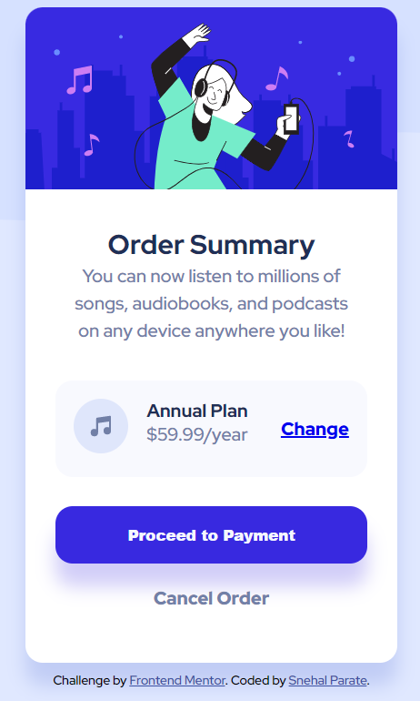

# Frontend Mentor - Order summary card solution

This is a solution to the [Order summary card challenge on Frontend Mentor](https://www.frontendmentor.io/challenges/order-summary-component-QlPmajDUj). Frontend Mentor challenges help you improve your coding skills by building realistic projects. 

## Table of contents

- [Overview](#overview)
  - [The challenge](#the-challenge)
  - [Screenshot](#screenshot)
  - [Links](#links)
- [My process](#my-process)
  - [Built with](#built-with)
  - [What I learned](#what-i-learned)
  - [Continued development](#continued-development)
  - [Useful resources](#useful-resources)
- [Author](#author)
- [Acknowledgments](#acknowledgments)


## Overview

### The challenge

Users should be able to:
- See Mobile-First Workflow
- See hover states for interactive elements

### Screenshot


Desktop view of the application.


Mobile view of the application.


### Links

- Solution URL: [Add solution URL here](https://github.com/snehal1791/order-summary-component-main)
- Live Site URL: [Add live site URL here](https://snehal1791.github.io/order-summary-component-main/)

## My process

### Built with

- Semantic HTML5 markup
- CSS custom properties
- Flexbox
- CSS Grid
- Mobile-first workflow

### What I learned

With this challenge I learned and implemented 
- Flexbox, specifically that an element can be made a flex container with `display: flex` and all of its direct children will automatically be laid out as flex items.

  ```css
  .plan-info-summary {
    background-color: #F8F9FE;
    border-radius: 0.95rem;
    flex-flow: 1 1 100%;
    display: flex;
    justify-content: space-between;
    align-items: center;
    align-content: center;
    margin-left: 8%;
    margin-right: 8%;
    padding: 0.5rem;
  }
  .plan-info-summary .music-icon,
  .plan-info-summary .price-change-btn {
      flex-flow: 1 1 15%;
  }
  .plan-info-summary .plan-price {
      flex-flow: 2 1 60%;
      align-self: center;
      color: var(--dark-blue);
  }
  ```

- Semantic HTML, that it includes usage of tags that provides meaning to different sections of the page, like below code snippets:

  - `<figure>`
    ```html
    <figure class="plan-info music-icon">
      
    </figure>
    ```
  - `<section>`
    ```html
    <section class="order-summary-header">
      <h1>  Order Summary</h1>
      <p>You can now listen to millions of songs, audiobooks, and podcasts on any device anywhere you like!</p>
    </section>
    ```

### Continued development

I would continue to improve my current skills on Semantic HTML, Flexbox and would learn to incorporate accessibility to make sure application works properly with assistive devices.

### Useful resources

- [Flexbox Tutorial (CSS): Real Layout Examples](https://www.youtube.com/watch?v=k32voqQhODc) - This is an amazing tutorial which helped me understand Flexbox. I'd recommend it to anyone still learning this concept.
- [Content Sectioning](https://developer.mozilla.org/en-US/docs/Web/HTML/Element#content_sectioning) - This helped me for applying Semantic HTML5 to organize the contents of the application. I really liked this pattern and will use it going forward.


## Author

- Website - [Snehal Parate](https://snehal1791.github.io/portfolio/)
- Frontend Mentor - [@snehal1791](https://www.frontendmentor.io/profile/snehal1791)
- Twitter - [@sne_hal_p](https://twitter.com/sne_hal_p)


## Acknowledgments

I was inspired by [Jake's](https://github.com/jakedesign/order-summary) and [Mr Coder's](https://www.youtube.com/watch?v=rCBYZ7xn-us) solution.
Their solutions help me better understand the problem.